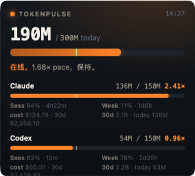
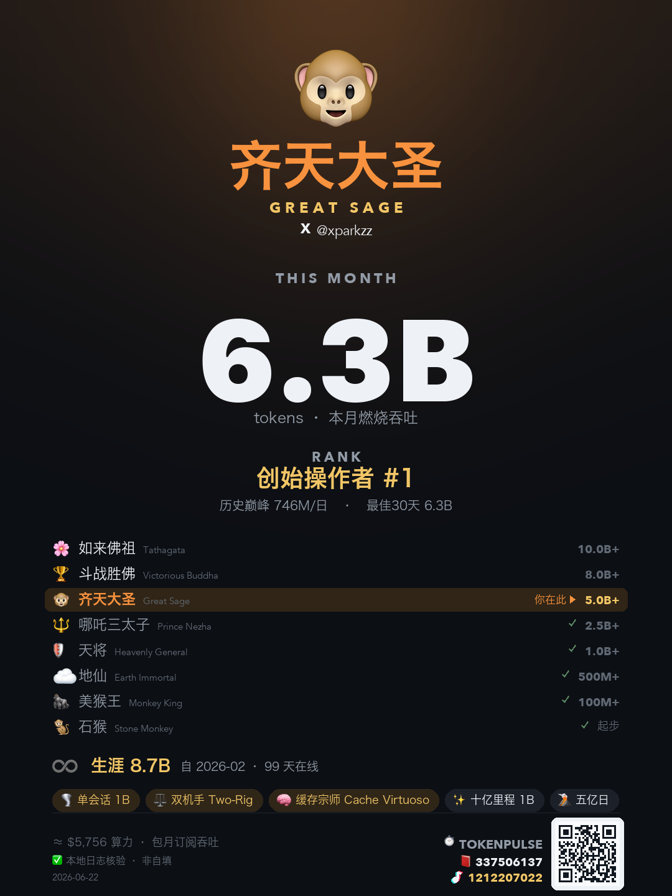

<div align="center">

# ⏱ TokenPulse

**把每日 token 用量做成会"鞭策"你的桌面 widget —— 用得少时让你坐立不安，逼自己把订阅额度榨干。烧得越多，西游记档位越高（石猴 → 齐天大圣 → 如来），一键生成可分享的竖版战绩卡。**

[](https://python.org)
[](https://pywebview.flowrl.com)
[](https://www.apple.com/macos)
[-green.svg)](#技术栈)

</div>

---

```
in   本地日志  ~/.claude/projects/**/*.jsonl (Claude) + ~/.codex/sessions/**/*.jsonl (Codex)
   + models.dev 单价表 (直连, 每日本地缓存)   [CodexBar 可选: 仅 Claude 的 session/weekly %]

out  常驻桌面 goad widget + Telegram 鞭策推送 + CLI 状态 + 可分享竖版战绩卡 (PNG + QR 分享页)
   鞭策面: 今日 token vs 150M/天目标 · pace 配速 · session/weekly 剩余额度 · today/30d cost
   战绩面: 西游记档位 · 生涯累计 · 单会话峰值 · 缓存命中率 · 徽章 · 顶部 X 身份 · 页脚 builder CTA

fail CodexBar 未运行 / 数据 >6h 旧  → Claude 额度显示 "—" / ⚠stale,其余照常工作
fail 模型不在价格表 (如新出的 claude-opus-4-8)  → 家族回退到最新同族费率,而非算成 $0
fail Telegram 凭证缺失  → 跳过推送,不报错
fail lifetime/peak 全量回填未完成  → 战绩卡先用今日值,后台扫完即补
fail cloudflared 不可用 / HTTPS tunnel 未拿到  → 降级到本地分享页 + Finder, 不假装手机可公网访问
```

`CodexBar 是里程表（只报原始数字）；TokenPulse 是教练 + 成长系统 —— 把数字对着每日目标算配速、落后时扎你一下，再把累计用量变成一张让你想晒的战绩卡。`

## 示例输出

桌面 widget（无边框、置顶、可拖动）。**整个表面随用量变情绪**：落后变冷蓝并扎心文案，超额变炽热发光。



竖版战绩卡（小红书 3:4）。顶部只放 X 身份；页脚保留 TokenPulse QR 和 builder 账号入口，用 icon + number 降低打扰感。



终端状态：

```bash
$ python3 cli.py
⏱  TokenPulse · 2026-06-15 14:37 · weekday

Claude 🔥 [████████████████░░░░░░] 136M/150M  (91%)  2.41× pace
      plan: session 84%left 4h22m  ·  weekly 71%left 1d0h
Codex  🙂 [████████░░░░░░░░░░░░░░] 54M/150M   need 96M · pace 56M
      plan: session 83%left 10m  ·  weekly 76%left 2d20h

Σ  190M/300M  (63%)
```

Telegram 鞭策（落后 pace 或周额度没跟上时）：

```
⏱ TokenPulse · 20:00 · Sun
Claude 😴 25M/150M — need 125M (pace 110M)
   plan session 99% 4h · weekly 88% 6d2h ⚠落后9%
Σ 38M/300M (12%)

▶ 去把 token 用掉：
resume [codex] 整理GitHub仓库三条管线 · 6h ago
```

## 架构

```
本地日志                                   models.dev/api.json  (直连, 每日缓存 .models-pricing.json)
~/.claude/projects/**/*.jsonl  ┐          ~/.codex/.../rate_limits  (Codex 5h/周额度, 本地)
~/.codex/sessions/**/*.jsonl   ┤          [CodexBar 落盘: 可选, 仅 Claude 额度]
                               │                  │
                               ▼                  ▼
   ┌──────────────────────────────────────────────────────────────────┐
   │  core.py   今日 token + 目标 + pace + mood                          │
   │  cost.py   today/30d cost + tokens + 缓存命中 (models.dev 直连)      │
   │  limits.py session/weekly 额度 (Codex 本地 / Claude 经可选 CodexBar) │
   ├──────────────────────────────────────────────────────────────────┤
   │  成长系统:  history.py 30d 序列 + 连续达标 + 在线时长                   │
   │            lifetime.py 永不裁剪生涯累计 + 单会话峰值 (peaks.py)         │
   │            continuity.py 最长连续在线   badges.py 西游记档位 + 徽章      │
   │            card.py 竖版战绩卡 PNG (Pillow) + builder QR/CTA            │
   └───────────────────────┬──────────────────────────────────────────┘
                           ▼  webdata.py  (合并成一个 payload)
   ┌───────────────┬───────────────┬──────────────┬───────────────┐
   ▼               ▼               ▼              ▼
webwidget.py      nudge.py        cli.py        furnace.py
web/widget.html   (Telegram 推送)  (终端状态)    (可选·自动烧额度)
常驻 goad widget + 战绩卡/QR 分享按钮              fuel.py (取料)
```

数据口径逐字段验证：

- **Token 计数** — Claude 按 `(message.id, requestId)` 去重（修正 transcript 重复写入导致的虚高，~485M → 真实 ~200M）；Codex 按 session UUID 去重、累加每轮 `last_token_usage`。
- **成本** — `tokens × models.dev 单价`，**直连 [models.dev](https://models.dev) 拉价格表**（每日本地缓存），新模型缺表时家族回退到最新同族费率。**不依赖 CodexBar**。
- **真实额度** — **Codex** 的 5h/周 % 直接读本地 `~/.codex` session 的 `payload.rate_limits`，无需 CodexBar。**Claude** 的 5h/周/opus % 只在 Anthropic 的 OAuth 接口里（token 需刷新、自己刷有把你登出 Claude Code 的风险），所以**当 CodexBar 在跑时**读它落盘的结果；没装也行，Claude 那两栏显示 `—`，其它全正常。**CodexBar 是可选增强，不是必需。**

## 🐵 升级体系 + 战绩卡

把累计用量做成"养电子宠物"式的成长系统，再变成一张**让你想晒**的竖版战绩卡（小红书 3:4）。核心理念：**卡片替你吹牛** —— 一眼读到的是档位名 + 排名，而不是数字；金额降到脚注；用量被框成"操作规模"而非"花了多少钱"。

分享逻辑是两层：

- **PNG 本身可转发**：卡片页脚内置 TokenPulse QR，扫码进入 `https://park-ai-intel.com/tokenpulse`；builder 入口以 X / 红书 / 抖音 icon + ID 呈现。
- **Widget 分享按钮**：本地生成 PNG，同时生成一个手机可扫的分享页 QR；有 `cloudflared` 时临时开 HTTPS，手机打开后可走系统分享面板，拿不到 tunnel 时降级为本地页面 + Finder。

**西游记档位**（按月滚动 token 孵化，`badges.py`）：

| 档位 | 阈值/月 | 档位 | 阈值/月 |
|------|---------|------|---------|
| 🐒 石猴 | 0 | 🔱 哪吒三太子 | 2.5B |
| 🦍 美猴王 | 100M | 🐵 齐天大圣 | 5B |
| ☁️ 地仙 | 500M | 🏆 斗战胜佛 | 8B |
| 🛡️ 天将 | 1B | 🌸 如来佛祖 | 10B (登顶) |

**指标**（都从本地日志算，卡上带"本地日志核验"防伪标）：

- **生涯累计**（`lifetime.py`）— 独立、永不裁剪的单调累加器（30d 缓存会在 120 天裁剪，撑不起"自第一天"），一次性全量回填 + 每日增量，今日实时值读取时叠加。
- **单会话峰值**（`peaks.py`）— 单次会话最大 token（Claude 按文件分组，子 agent 会复用父 sessionId）。
- **缓存命中率** — 30d `cache_read / 总输入`（深上下文操作的专家信号；Claude 各桶不相交，Codex `cached` 是 `input` 子集）。
- **连续达标 streak / 单日峰值 / 周环比增长** — 卡上徽章。
- **在线时长 / 最长连续在线**（`history.daily_active_minutes` 合并双工具时间线 + `continuity.py`）— **仅面板**，标"在线/活跃"而非"开发"（idle-gap 代理会被后台自动化括大，不上公开卡以保可信度）。

**排名诚实**：全球百分比要有真实用户池（≥200）才显示 "Top X%"；在那之前卡片只显示**对比你自己**（历史巅峰 / 最佳30天）+ **创始操作者 #1**，**绝不编造百分比**。

> **路线图**：可选的全球排行榜 + 朋友对比（Cloudflare Worker + D1，朋友邀请码几人即可玩）已设计完成，等准备分发时再部署。

## 快速开始

**前置**：macOS · `python3 ≥ 3.11`。可选：`cloudflared`（分享走临时 HTTPS）、CodexBar（补 Claude 的 session/weekly %）。

```bash
# 1. 克隆
git clone https://github.com/zinan92/tokenpulse.git
cd tokenpulse

# 2. 一键安装：装依赖 + 首次从 config.example.json 生成 config.json + 装成 launchd 常驻
#    （widget 开机自启 / 崩溃重拉，Telegram 定时鞭策）
./install.sh
#    然后在 widget 的「设置」面板填上你的 X / 小红书号（战绩卡署名）；卡片页脚的
#    builder CTA 是作者署名，跟着每张卡走，不用你管。

# —— 或者手动跑（不装常驻）——
pip3 install -r requirements.txt
python3 cli.py          # 终端看今日状态（最轻量，core/cli 纯 stdlib）
python3 webwidget.py    # 桌面 goad widget（无边框置顶，可拖动）

# —— 只想要终端命令？装个全局 CLI（纯 stdlib，零重依赖）——
pipx install .          # 之后直接 `tokenpulse` / `tokenpulse-nudge`
```

> 桌面 widget 自带 `web/` UI + launchd，所以走 `./install.sh`（从 checkout 跑）；`pipx` 只装终端 `tokenpulse` 命令。
>
> **CodexBar 可选**（[steipete/codexbar](https://github.com/steipete/codexbar)）：只用于 **Claude** 的 session/weekly % 那两栏。没装也能跑——token、cost、Codex 额度全部正常，Claude 额度那两栏显示 `—`。

## 功能一览

| 功能 | 说明 | 状态 |
|------|------|------|
| 今日 token 追踪 | Claude + Codex 两 plan，去重 | ✅ |
| pace 配速 + mood | 本地 24h 为窗口算"该到哪 vs 实际到哪"，落后/达标/超额状态机 | ✅ |
| 真实 session/weekly 额度 | Codex 直读本地；Claude 经可选 CodexBar；带重置倒计时 + 周配速 | ✅ |
| today/30d cost + tokens + 缓存命中 | models.dev 单价**直连**，新模型家族回退 | ✅ |
| **🐵 西游记档位 + 徽章** | 按月用量孵化 8 档（石猴→如来），多维徽章（`badges.py`） | ✅ |
| **可分享竖版战绩卡** | 小红书 3:4、竖向天梯、SF Compact + 思源黑体、顶部 X 身份 + 页脚 builder CTA（`card.py`） | ✅ |
| **QR 分享页** | 分享按钮生成 PNG + 移动分享页 QR；有 `cloudflared` 时走临时 HTTPS（系统分享 + `og:image` 让 X 展开卡片），否则绑 LAN（手机同 wifi 可扫开、保存图片）| ✅ |
| **生涯累计 / 单会话峰值** | 永不裁剪的单调累加器（`lifetime.py` / `peaks.py`） | ✅ |
| 在线时长 / 最长连续在线 | 合并双工具时间线（`history` / `continuity.py`）— 仅面板 | ✅ |
| goad widget (web) | 暗色、drenched 状态反应、count-up、达标 flare、详情面板 + 战绩卡按钮 | ✅ |
| Telegram 鞭策 | 落后 pace 或周额度没跟上时推 | ✅ |
| 终端 CLI | `--json` / `--sessions` | ✅ |
| furnace 自动烧额度 | 落后时无人值守派一个队列/循环作业给更落后的 plan | ⚙️ 默认关闭 |
| 全球排行榜 + 朋友对比 | Cloudflare Worker + D1，已设计；待分发时部署 | 🗺️ 路线图 |

## 技术栈

| 层级 | 技术 | 用途 |
|------|------|------|
| 引擎 | Python 3.13 **纯 stdlib** | 日志提取、目标/配速、成本、档位/徽章/累计（core/cost/limits/badges/lifetime/… 零依赖） |
| 战绩卡 / QR | `Pillow` + `qrcode` | 渲染竖版 PNG、builder QR、手机分享页 QR |
| Widget UI | `pywebview` (Cocoa WebKit) + HTML/CSS/JS | 无边框置顶 goad 窗口，~100–200MB，远轻于 Electron |
| 数据源 | 本地日志 + models.dev (直连) | 本机零外部依赖；CodexBar 仅可选地补 Claude 额度 |
| 常驻 | macOS `launchd` (framework python) | widget + nudge 两个 LaunchAgent |
| 通知 | Telegram Bot API (openclaw `wendy` bot) | 鞭策推送 |

## 项目结构

```
tokenpulse/
├── core.py            # 引擎：token 提取 + 每日目标 + pace + mood
├── cost.py            # today/30d cost + tokens + 缓存命中（models.dev 直连 + 家族回退）
├── limits.py          # session/weekly 额度（Codex 本地 / Claude 经可选 CodexBar）
│   ── 成长系统 ──
├── badges.py          # 西游记档位 + 多维徽章 + card_data()（卡片/面板唯一数据源）
├── card.py            # 竖版战绩卡 PNG（Pillow）+ builder CTA/QR
├── lifetime.py        # 永不裁剪的生涯累计 + 单会话峰值（schema v2）
├── peaks.py           # 单次会话峰值扫描
├── continuity.py      # 最长连续在线（合并时间线，30min 断点）
├── history.py         # 30d token 序列 + 连续达标 + 合并在线时长（含磁盘缓存）
├── configio.py        # 设置面板可编辑子集的读/校验/写（targets / handle / xhs_id）
│   ── 出口 ──
├── sessions.py        # 最近 5 天会话 →「去 resume 这个」
├── webdata.py         # 合并 core/limits/cost → widget 的 JSON 桥
├── webwidget.py       # pywebview 宿主（无边框置顶）+ 战绩卡/设置 API
├── web/widget.html    # goad UI：状态反应配色 + 动效 + 详情面板（自包含）
├── share.py           # 战绩卡分享页、QR、临时 cloudflared HTTPS tunnel
├── nudge.py           # Telegram 鞭策（落后时）
├── furnace.py / fuel.py   # 可选：无人值守自动烧额度
├── cli.py             # 终端状态
├── config.example.json # 出厂模板（owner 字段留空）；install.sh 首次拷成 config.json
├── config.json        # 你的本地实例（gitignore，不入库）：目标 / 署名 / 阈值 / furnace
├── install.sh / uninstall.sh  # launchd 常驻装/卸（含装依赖 + 首跑配置）
├── pyproject.toml     # 打包：pipx 装全局 `tokenpulse` / `tokenpulse-nudge` 命令
└── tests/             # pytest（99 passing）
```

## 配置

`config.json` 由 `install.sh` 首次从 `config.example.json` 生成（owner 字段留空），**不入库**——所以克隆下来的是干净模板，署名是你自己的，不是作者的。`builder` 那块是写死的作者署名（页脚 CTA），不在这里改。字段：

| 字段 | 说明 | 默认 |
|------|------|------|
| `targets.{claude,codex}.{weekday,weekend}` | 每日 token 目标（百万） | `150` |
| `handle` | 战绩卡顶部 X handle（空则回退 git 用户名 / `you`） | `""` |
| `xhs_id` | 当前用户小红书号（保留给设置/数据；公开卡顶部不再显示） | `""` |
| `builder` | 卡片页脚 builder CTA（X handle / 红书 ID / 抖音 ID / QR URL） | `xparkzz` |
| `share` | QR 分享页设置（cloudflared/local/base_url/端口） | 临时 cloudflared |
| `active_window` | pace 配速窗口；`00:00–00:00` = 整 24h（按本地时区） | `00:00–00:00` |
| `day_boundary` | 日界：`local`（你的时区）或 `utc` | `local` |
| `checkpoints` | Telegram 推送时间点 | `15:00 / 20:00 / 23:00` |
| `plan_behind_threshold` | 周额度落后多少个百分点才算"落后"并触发推送 | `10` |
| `furnace.enabled` | 自动烧额度总开关（kill switch） | `false` |

> `handle` / `xhs_id` 也能在 widget 详情面板的「设置」里直接填；公开卡顶部只展示 X handle，页脚 builder CTA 使用 icon + ID。


## For AI Agents

TokenPulse 是**本机 CLI / 桌面工具**，不暴露 HTTP API。要把它当数据源用，直接调 CLI 或 import 模块。

### Capability Contract

```yaml
name: tokenpulse
capability:
  summary: Track daily token usage across Claude Code + Codex subscription plans, goad the user to use more, and turn cumulative usage into a shareable leveling card.
  in: local logs (~/.claude/projects, ~/.codex/sessions) + models.dev prices (direct). CodexBar optional (only Claude's session/weekly %).
  out: always-on-top "goad" desktop widget + Telegram nudges + CLI status (today tokens vs target, pace, session/weekly %, cost) + a shareable portrait "战绩卡" PNG (西游记 tier + lifetime total + single-session peak + cache hit-rate + badges)
  fail:
    - "CodexBar not running / data >6h stale → plan limits show — / ⚠stale; token tracking still works"
    - "model missing from price table → family fallback to latest sibling's rate (not $0)"
    - "Telegram creds missing → nudge skips, no error"
    - "outside active window (overnight/pre-09:00) → 'early' state, no false pace verdict"
cli_command: python3 cli.py
cli_flags:
  - name: --json
    type: boolean
    description: emit the full status payload as JSON instead of the terminal view
  - name: --sessions
    type: boolean
    description: list recent resumable Claude/Codex sessions
programmatic_entry: "import webdata; webdata.core_payload()  # goal/pace/limits · webdata.cost_payload() cost · import badges; badges.card_data() tier/lifetime/badges · import card; card.make_card() render PNG · import share; share.build_share_payload(path) QR/share page"
install_command: "./install.sh   # deps + first-run config + launchd widget/nudge   ·   or: pipx install .   # global `tokenpulse` CLI (stdlib only)"
start_command: "python3 webwidget.py   # widget  ·  python3 cli.py   # status  ·  python3 nudge.py   # telegram"
requires: "nothing external for core (tokens/cost via models.dev, Codex limits local); CodexBar optional, only for Claude's session/weekly %"
```

### Agent 调用示例

```python
import subprocess, json

# 拿今日状态的结构化数据
out = subprocess.run(["python3", "cli.py", "--json"], cwd="~/work/tokenpulse",
                     capture_output=True, text=True).stdout
status = json.loads(out)
combined = status["status"]["combined"]   # {today, target, percent, ...}
if combined["today"] < combined["expected"]:
    print(f"Behind pace: {combined['today']/1e6:.0f}M of expected {combined['expected']/1e6:.0f}M")

# 或直接 import（同目录）
import webdata
core = webdata.core_payload()             # 目标/配速/额度
cost = webdata.cost_payload()             # today/30d cost + tokens
```

## License

Private / personal use.
